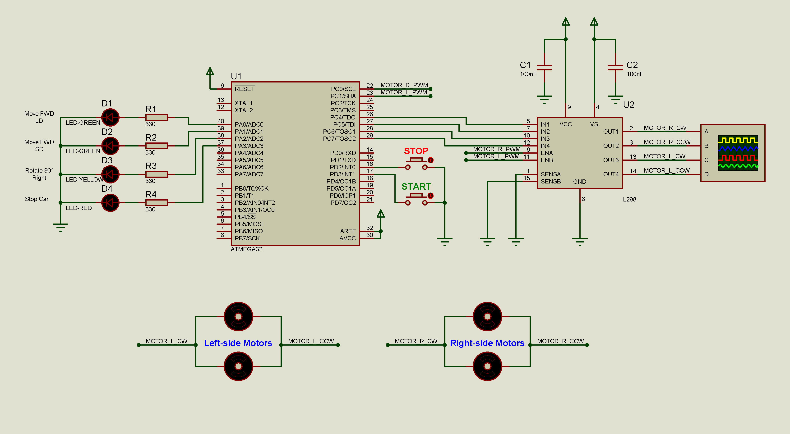
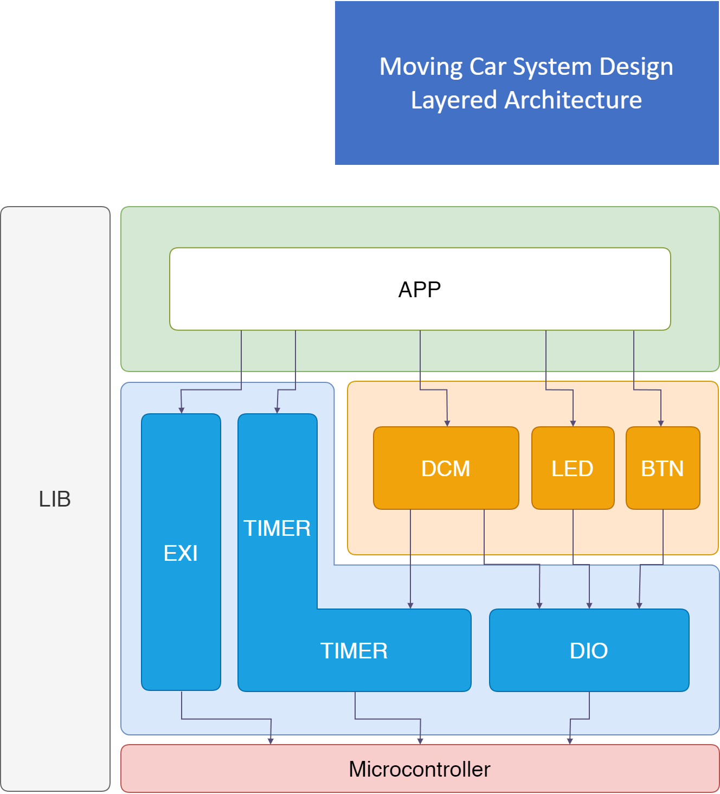

# Moving-Car-Project
#### Embedded Systems - Level 1
#### Author: Team 1 - Hacker Kermit
- #### Members:
  - Abdelrhman Walaa
  - Hossam Elwahsh
  - Mahmoud Mowafey
  - Tarek Elgohry

## Brief
> Embedded C application controlling a four-driving wheel robot, and moving it in a rectangular shape.

## Quick Links
> - `Project Documentation`
>     👉 [PDF](Documents/Hacker%20Kermit%20-%20Moving%20Car%20System%20Design.pdf) 
>     👉 [Google Docs](https://docs.google.com/document/d/1bXYYHoOgidVj3zUbWvrPtRIPm7UxENJLMehARkkGyD0/edit?usp=sharing)
> - `Video` 👉 [Watch on Youtube](https://youtu.be/LwTwtsUVyQ0)
> - `Team Backlog` 👉 [Google Sheets](https://docs.google.com/spreadsheets/d/1TEFmVHJRjowdOIW17CrRRDPIgnifnU0cA95UgYCEQuI/edit?usp=sharing) 👉 [Excel](Documents/Hacker%20Kermit%20-%20Team%20Log%20Moving%20Car.xlsx)
> - `Test Protocol` 👉 [Google Sheets](https://docs.google.com/spreadsheets/d/1TEFmVHJRjowdOIW17CrRRDPIgnifnU0cA95UgYCEQuI/edit?usp=sharing#gid=1200153160) 👉 [Excel ](Test%20Cases/Hacker%20Kermit%20-%20Test%20Protocol%20Moving%20Car.xlsx)
> - ---
> ### Technical
> - `Proteus Simulation (Proteus 8.15)` 👉 [Moving-Car-Project.pdsprj](Simulation/Moving-Car-Project.pdsprj)
> #### for older proteus version you can import the proteus clip file (pdsclip) and update the MC hex file:
> - `Proteus clip file` 👉 [MovingCar.pdsclip](Simulation/MovingCar.pdsclip)
> - `Project Hex` 👉 [MovingCar.hex](Simulation/MovingCar.hex)

### Requirements
#### Suppose you have a four-driving wheel robot, you are required to design the system so that the car moves in a rectangular shape

### Detailed Requirements
#### Create a backlog for the team
1. Create an excel sheet named Team Backlog that contains the below columns
   1. Task Name
   2. Assignee
   3. Task Status
   4. Expected time to finish
   5. Actual time to finish

#### System Requirement Specifications
    1. Car Components:
        1. Four motors (M1, M2, M3, M4)
        2. One button to start (PB1)
        3. One button for stop (PB2)
        4. Four LEDs (LED1, LED2, LED3, LED4)
    
    2. System Requirements:
        1. The car starts initially from 0 speed
        2. When PB1 is pressed, the car will move forward after 1 second
        3. The car will move forward to create the longest side of the rectangle for 3 seconds with
            50% of its maximum speed
        4. After finishing the first longest side the car will stop for 0.5 seconds, rotate 90 degrees
            to the right, and stop for 0.5 second
        5. The car will move to create the short side of the rectangle at 30% of its speed for 2 seconds
        6. After finishing the shortest side, the car will stop for 0.5 seconds, rotate 90 degrees to the right, 
            and stop for 0.5 second
        7. Steps 3 to 6 will be repeated infinitely until you press the stop button (PB2)
        8. PB2 acts as a sudden break, and it has the highest priority
        9. LEDs Operations
            1. LED1: On means moving forward on the long side
            2. LED2: On means moving forward on the short side
            3. LED3: On means stop
            4. LED4: On means Rotating
---------

## Circuit Schematic

## Layered Architecture

